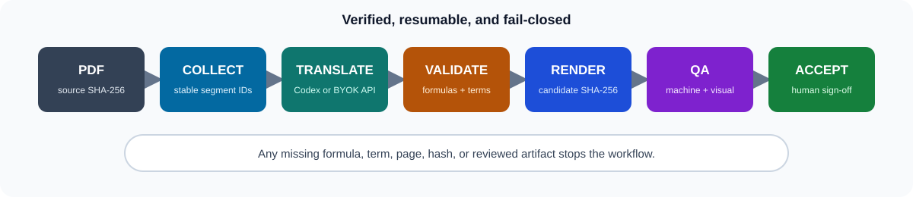
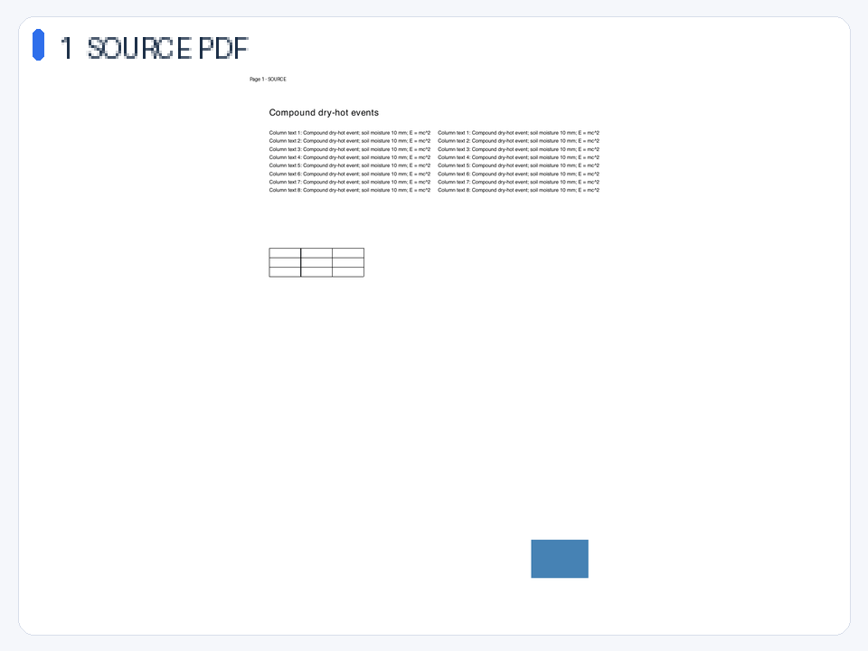

# PaperLocale

[](https://github.com/hazugi2004/paperlocale/actions/workflows/tests.yml)
[](https://github.com/hazugi2004/paperlocale/releases/latest)
[](LICENSE)

Verified, layout-preserving academic PDF translation with pluggable model providers and domain-specific terminology packs.

[中文说明](README.zh-CN.md)



The demo below is generated from PaperLocale's own one-page, double-column PDF
fixture. It contains formula text, a vector table, and an embedded image; no
copyrighted paper is redistributed.



## Status

PaperLocale is under active development. The first release focuses on one strict pipeline:

1. collect translatable segments from a PDF layout engine;
2. translate them with one explicitly selected provider;
3. reject translations that lose formulas, style tags, numbers, units, abbreviations, URLs, DOIs, or required terminology;
4. rebuild the PDF without changing its page geometry;
5. render every page and produce a reviewable QA report.

The project does not promise bitwise-identical typography. Chinese text naturally changes line breaks. Its promise is narrower and testable: preserve the page structure and protected scientific content, and fail before rendering when that contract is broken.

## Implemented providers and gates

- `codex-local`: local-only translation through an authenticated Codex CLI session;
- `openai-compatible`: BYOK access to OpenAI and compatible endpoints;
- an extensible `atmospheric-science` pack with terminology and evaluation cases;
- a resumable `collect -> translate -> validate -> render -> qa -> accept` workflow;
- page geometry, image-object, vector-drawing, blank-page, placeholder, and all-page visual checks.

PaperLocale never reads or copies Codex authentication files. ChatGPT-managed Codex access is for trusted local use only and is not exposed as a public translation API.

## Domain packs

The first built-in pack is `atmospheric-science`. A pack contains a manifest, glossary, prompt rules, and evaluation cases. New disciplines can be added without changing the translation pipeline.

```bash
python -m paperlocale domain-check atmospheric-science
python -m paperlocale validate-segments \
  --segments segments.jsonl \
  --translations translations.jsonl \
  --domain atmospheric-science
```

Evaluate a real Provider on every public domain case and save candidates next
to their references:

```bash
paperlocale provider-eval \
  --provider codex-local \
  --domain atmospheric-science \
  --output provider-eval.json
```

The report automatically evaluates only the hard content contract and exact
reference matches. It never treats string similarity as semantic accuracy;
every candidate remains marked for manual domain review.

## Install

Python 3.10–3.13 and Poppler's `pdftoppm` are required for the complete workflow.

```bash
git clone https://github.com/hazugi2004/paperlocale.git
cd paperlocale
python -m venv .venv
source .venv/bin/activate
python -m pip install -e ".[layout]"
paperlocale domain-check atmospheric-science
```

## Quick start

Use one resumable command to initialize the run, collect layout segments,
translate, validate, rebuild, and generate all-page QA:

```bash
# Uses the authenticated Codex CLI session on this trusted local machine.
paperlocale run paper.pdf --run-dir runs/paper \
  --provider codex-local --domain atmospheric-science

# Inspect every image under runs/paper/qa/comparisons/ before acceptance.
paperlocale accept --run-dir runs/paper --reviewed-by "Your name"
```

If a stage fails, rerun the same `paperlocale run` command. The manifest resumes
from the last completed stage and validated translation batches are reused.
The command deliberately stops at `qa_generated`; it never records human
acceptance. Once translation is complete, a resume command does not need
`--provider` or API credentials.

For a BYOK OpenAI-compatible endpoint:

```bash
export PAPERLOCALE_API_KEY="your-key"
paperlocale run paper.pdf --run-dir runs/paper \
  --provider openai-compatible \
  --base-url https://api.example.com/v1 \
  --model your-model \
  --domain atmospheric-science
```

Remote compatible endpoints must use HTTPS. Plain HTTP is accepted only for
loopback services on `localhost`, `127.0.0.1`, or `::1`.

For explicit stage-by-stage control, the same production path remains available
as `init-run -> collect -> translate -> validate -> render -> qa -> accept`.

See the detailed [Chinese guide](README.zh-CN.md), [ROADMAP](docs/ROADMAP.md), [ARCHITECTURE](docs/ARCHITECTURE.md), [domain-pack guide](docs/DOMAIN_PACKS.zh-CN.md), [Codex for Open Source readiness](docs/CODEX_FOR_OSS_READINESS.zh-CN.md), and [PROVENANCE](docs/PROVENANCE.md).

## Development

Unit tests do not call a model or require the layout engine:

```bash
python -m pip install -e ".[test]"
python -m unittest discover -s tests -v
```

After layout-engine upgrades, run the deterministic full-path smoke test:

```bash
python -m pip install -e ".[layout,test]"
python scripts/layout_smoke.py \
  --output tmp/layout-smoke-001 \
  --demo-gif tmp/layout-smoke-001.gif
```

The script intentionally stops before visual acceptance and prints the comparison image to inspect.
The scheduled compatibility workflow repeats this real CLI check weekly against
the newest `pdf2zh-next` release allowed by the declared dependency range.

## Contributing

Start with the scoped [good first issues](https://github.com/hazugi2004/paperlocale/issues?q=is%3Aissue+is%3Aopen+label%3A%22good+first+issue%22), or read [CONTRIBUTING.md](CONTRIBUTING.md). Current entry points cover an ecology domain pack, a two-page synthetic PDF regression, and Ubuntu installation verification.

## License

GNU Affero General Public License v3.0 only. This choice is aligned with the AGPL-licensed PDF layout engines the project is designed to integrate.
